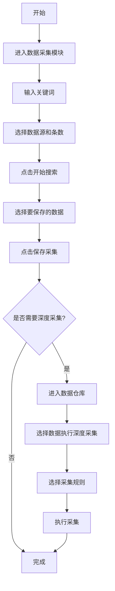
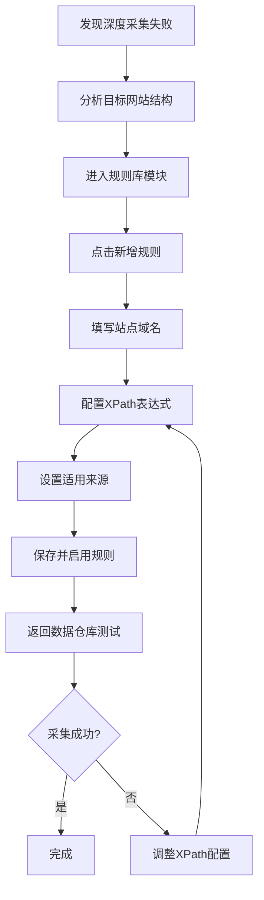
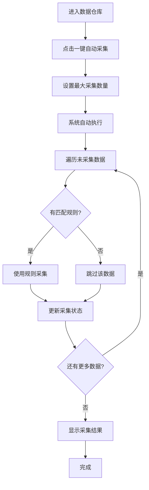

# 政企智能舆情分析系统 - 产品使用说明

## 一、系统概述

政企智能舆情分析系统是一个用于新闻数据采集、管理和分析的综合平台。系统提供从数据搜索、深度采集到智能分析的完整解决方案。

### 核心功能模块

| 模块 | 功能说明 |
|------|----------|
| 数据采集 | 从百度新闻、360新闻等平台搜索并采集新闻数据 |
| 数据仓库 | 管理已采集的新闻数据，支持深度采集和批量操作 |
| 规则库 | 配置网站采集规则（XPath），提高深度采集成功率 |
| AI引擎 | 配置AI分析引擎，用于智能舆情分析 |
| AI数据分析 | 使用AI助手分析数据库中的数据，支持自然语言查询 |
| 爬虫管理 | 管理和配置数据采集爬虫 |

### 数据存储

系统使用 **SQLite** 数据库存储所有数据，数据库文件位于 `instance/app.db`。

#### 数据表说明

| 数据表 | 说明 | 主要字段 |
|--------|------|----------|
| `collected_news` | 采集的新闻数据 | 标题、摘要、正文、来源、URL、发布时间、作者 |
| `crawl_rules` | 采集规则配置 | 规则名称、站点域名、XPath表达式、优先级 |
| `crawler_configs` | 爬虫配置 | 爬虫名称、搜索URL、请求头、超时设置 |
| `ai_engines` | AI引擎配置 | 引擎名称、API地址、密钥、模型参数 |
| `users` | 用户账户 | 用户名、密码、角色、状态 |
| `system_config` | 系统配置 | 配置键值对 |

---

## 二、功能模块详解

### 2.1 数据采集模块

**入口**：左侧菜单 → 数据采集

**功能说明**：从新闻平台搜索并采集新闻列表数据。

#### 使用步骤

1. **输入关键词**：在搜索框输入要采集的关键词（如"成都"、"人工智能"）
2. **选择数据源**：选择百度新闻或360新闻
3. **设置采集条数**：输入需要采集的条数（1-200条）
4. **开始搜索**：点击"开始搜索"按钮
5. **选择数据**：勾选需要保存的新闻条目
6. **保存采集**：点击"保存采集"按钮，系统会显示实时进度条

#### 采集的数据字段

| 字段 | 说明 |
|------|------|
| 标题 | 新闻标题 |
| 摘要 | 新闻概要 |
| 来源 | 新闻来源（如百度新闻、360新闻） |
| URL | 原始新闻链接 |
| 封面图 | 新闻封面图片 |

> **提示**：保存时系统会自动尝试深度采集正文内容

---

### 2.2 数据仓库模块

**入口**：左侧菜单 → 数据仓库

**功能说明**：管理已采集的新闻数据，支持深度采集、编辑、删除等操作。

#### 主要功能

| 功能 | 说明 |
|------|------|
| 查看数据 | 浏览所有已采集的新闻数据 |
| 深度采集 | 获取新闻正文、发布时间、作者等详细信息 |
| 一键自动采集 | 自动为有匹配规则的数据执行深度采集 |
| 编辑/删除 | 修改或删除数据 |
| 筛选过滤 | 按来源、采集状态、关键词等筛选 |

#### 深度采集方式

**方式一：单条深度采集**
1. 在数据列表找到目标数据
2. 点击操作栏的"深度采集"按钮
3. 选择要使用的采集规则（系统会自动推荐匹配的规则）
4. 点击"开始采集"

**方式二：批量深度采集**
1. 勾选多条需要采集的数据
2. 点击工具栏"深度采集"按钮
3. 选择采集规则
4. 点击"开始采集"

**方式三：一键自动采集**
1. 点击"一键自动采集"按钮
2. 设置最大采集数量
3. 系统自动匹配规则并执行采集

#### 来源高亮说明

- **绿色高亮**：该来源有匹配的采集规则，深度采集成功率高
- **普通显示**：该来源暂无匹配规则，使用通用规则采集

---

### 2.3 规则库模块

**入口**：左侧菜单 → 规则库

**功能说明**：配置网站采集规则，提高深度采集的成功率和数据质量。

#### 规则字段说明

| 字段 | 必填 | 说明 |
|------|------|------|
| 规则名称 | 是 | 规则的名称，便于识别 |
| 站点域名 | 是 | 目标网站的域名（如 `360kuai.com`） |
| 适用来源 | 否 | 该规则适用的数据来源（如百度新闻、360新闻） |
| 标题XPath | 否 | 提取标题的XPath表达式 |
| 内容XPath | 否 | 提取正文的XPath表达式 |
| 请求头 | 否 | 自定义HTTP请求头（JSON格式） |
| 优先级 | 否 | 规则优先级，数值越大优先级越高 |
| 状态 | 是 | 启用/禁用 |

#### XPath 配置示例

```
标题XPath: //h1//text() | //div[@class="title"]//text()
内容XPath: //div[@class="article-content"]//p//text()
```

#### 规则匹配逻辑

系统按以下优先级匹配规则：

1. **适用来源匹配**：规则的"适用来源"包含数据的来源名称
2. **域名匹配**：数据URL的域名与规则的"站点域名"匹配
3. **内置规则**：使用系统内置的规则（百度百家号、360快资讯等）
4. **通用规则**：使用通用解析方法（成功率较低）

#### 常用操作

| 操作 | 说明 |
|------|------|
| 新增规则 | 为新网站添加采集规则 |
| 复制规则 | 复制现有规则，快速创建相似规则 |
| 编辑规则 | 修改规则配置 |
| 启用/禁用 | 控制规则是否生效 |
| 查看关联数据 | 查看使用该规则采集的数据 |

---

### 2.4 AI数据分析模块

**入口**：左侧菜单 → AI数据分析

**功能说明**：使用AI助手通过自然语言分析和查询数据库中的数据。

#### 界面布局

| 区域 | 说明 |
|------|------|
| 左侧面板 | 显示数据库所有表的信息（表名、列数、行数） |
| 右侧对话区 | 与AI助手对话，输入问题获取分析结果 |
| 引擎选择器 | 切换不同的AI引擎 |
| 快捷问题 | 一键提问常用问题 |

#### 支持的查询类型

| 类型 | 示例 |
|------|------|
| 数据库概况 | "数据库有哪些表？每个表有多少数据？" |
| 表结构查询 | "collected_news表有哪些字段？" |
| 数据统计 | "统计不同来源的新闻数量" |
| 数据查询 | "查询最近采集的10条新闻" |
| 数据分析 | "分析采集的新闻数据的整体情况" |

#### AI工具能力

AI助手可以自动调用以下工具：

| 工具 | 功能 |
|------|------|
| get_table_list | 获取数据库中所有表的列表 |
| get_table_schema | 获取指定表的结构信息 |
| execute_sql_query | 执行SQL查询（仅支持SELECT） |
| get_data_statistics | 获取表或列的统计信息 |

#### 安全限制

- SQL查询仅支持 **SELECT** 语句
- 禁止 DROP、DELETE、UPDATE、INSERT 等危险操作
- 查询结果默认限制100条

#### 使用步骤

1. 进入AI数据分析页面
2. 在右侧对话框输入问题（如"帮我分析新闻数据"）
3. 点击发送或按Enter键
4. AI会自动查询数据库并返回分析结果
5. 可点击左侧表名快速提问该表的信息

---

## 三、模块关系图

```
┌─────────────────────────────────────────────────────────────────┐
│                        数据采集流程                              │
└─────────────────────────────────────────────────────────────────┘

    ┌──────────────┐         ┌──────────────┐         ┌──────────────┐
    │              │         │              │         │              │
    │   数据采集    │ ──────> │   数据仓库    │ <────── │    规则库    │
    │              │  保存    │              │  匹配    │              │
    └──────────────┘         └──────────────┘         └──────────────┘
          │                        │                        │
          │                        │                        │
          ▼                        ▼                        │
    ┌──────────────┐         ┌──────────────┐              │
    │  搜索新闻    │         │  深度采集    │ <────────────┘
    │  列表数据    │         │  正文内容    │    使用规则
    └──────────────┘         └──────────────┘
```

---

## 四、完整使用流程

### 4.1 标准采集流程



### 4.2 规则配置流程



### 4.3 一键自动采集流程



---

## 五、最佳实践

### 5.1 提高深度采集成功率

1. **优先配置规则**：对于常用的新闻源，建议在规则库中配置专用规则
2. **使用浏览器开发者工具**：F12打开开发者工具，分析网页结构获取正确的XPath
3. **设置适用来源**：将规则与数据来源关联，提高匹配准确性
4. **测试规则**：配置规则后，先用少量数据测试，确认无误后再批量采集

### 5.2 XPath 编写技巧

```
# 常用XPath模式

# 按类名匹配
//div[@class="article-content"]//text()
//div[contains(@class,"content")]//p//text()

# 按ID匹配
//div[@id="article"]//text()

# 组合多个路径（用 | 分隔）
//h1//text() | //title/text()

# 排除某些元素
//div[@class="content"]//p[not(@class="ad")]//text()
```

### 5.3 域名填写规范

| 正确示例 | 错误示例 |
|----------|----------|
| `360kuai.com` | `https://www.360kuai.com/` |
| `baijiahao.baidu.com` | `http://baijiahao.baidu.com/s?id=123` |
| `news.sina.com.cn` | `新浪新闻` |

---

## 六、常见问题

### Q1: 深度采集失败怎么办？

**A**: 检查以下几点：
1. 目标网站是否有反爬虫限制
2. 规则库中是否有匹配的规则
3. XPath表达式是否正确
4. 网站结构是否发生变化

### Q2: 如何判断是否需要配置规则？

**A**:
- 如果数据仓库中来源列显示绿色高亮，说明已有匹配规则
- 如果使用"通用规则"采集失败，建议配置专用规则

### Q3: 一键自动采集跳过了很多数据？

**A**: 被跳过的数据通常是因为：
1. 没有匹配的采集规则
2. 数据缺少URL
3. 数据已经完成深度采集

### Q4: 如何复制其他规则？

**A**: 在规则库中，点击目标规则操作栏的"复制"按钮，系统会创建一个带"_副本"后缀的新规则，修改后保存即可。

---

## 七、系统架构图

```
┌──────────────────────────────────────────────────────────────────────────────────┐
│                            政企智能舆情分析系统                                     │
├──────────────────────────────────────────────────────────────────────────────────┤
│                                                                                  │
│  ┌──────────┐  ┌──────────┐  ┌──────────┐  ┌──────────┐  ┌──────────────────┐  │
│  │ 数据采集  │  │ 数据仓库  │  │  规则库  │  │  AI引擎  │  │    AI数据分析    │  │
│  │          │  │          │  │          │  │          │  │                  │  │
│  │·关键词搜索│  │·数据管理  │  │·规则配置 │  │·引擎配置 │  │·自然语言查询     │  │
│  │·多源采集  │  │·深度采集  │  │·XPath编辑│  │·模型参数 │  │·数据统计分析     │  │
│  │·批量保存  │  │·自动采集  │  │·优先级   │  │·API管理  │  │·SQL查询(只读)    │  │
│  └─────┬────┘  └─────┬────┘  └────┬─────┘  └────┬─────┘  └────────┬─────────┘  │
│        │             │            │             │                  │            │
│        └─────────────┼────────────┘             │                  │            │
│                      │                          │                  │            │
│                      ▼                          │                  │            │
│             ┌─────────────────┐                 │                  │            │
│             │    数据库       │ <───────────────┴──────────────────┘            │
│             │   (SQLite)      │                                                 │
│             │                 │                                                 │
│             │ · collected_news (采集的新闻数据)                                   │
│             │ · crawl_rules (采集规则配置)                                        │
│             │ · crawler_configs (爬虫配置)                                       │
│             │ · ai_engines (AI引擎配置)                                          │
│             │ · users (用户账户)                                                 │
│             │ · system_config (系统配置)                                         │
│             └─────────────────┘                                                 │
│                                                                                 │
└─────────────────────────────────────────────────────────────────────────────────┘
```

---

## 八、版本信息

- **系统名称**：政企智能舆情分析系统
- **技术架构**：Flask + SQLite + Layui
- **数据库文件**：`instance/app.db`
- **文档版本**：v1.1
- **更新日期**：2025年12月

### 更新日志

**v1.1 (2025-12-05)**
- 新增 AI数据分析模块，支持自然语言查询数据库
- 新增 爬虫管理模块
- 完善数据库表结构说明

---

> 如有问题或建议，请联系系统管理员。
